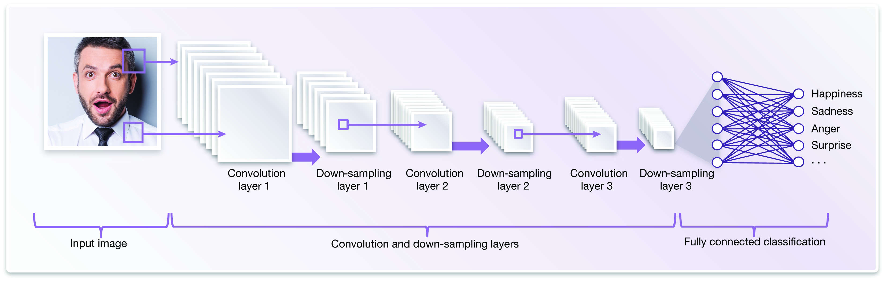

# FYP
Emotion recognition. 
Read notes.txt for information about the files.

So i have used Convolution Neural Network for classifying the emotion of a person.

image courtesy https://www.embedded-vision.com/platinum-members/embedded-vision-alliance/embedded-vision-training/documents/pages/facial-analysis

This image gives a simple idea of our implemntation but not the exact way
